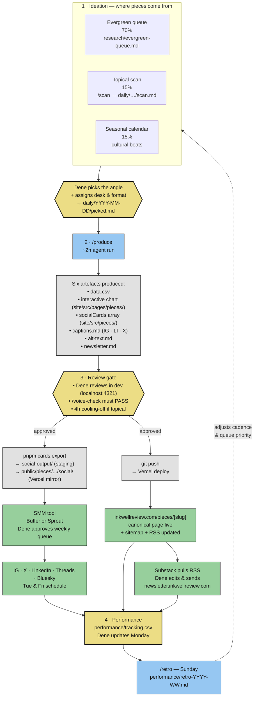

# Inkwell Review — the pipeline

*How an idea becomes a published post. One canonical picture, then the plain-English walkthrough.*

*Last updated: 21 April 2026 (Session 8). Update this doc when the pipeline changes shape.*

---

## The elevator

Inkwell Review ships twice a week: Tuesday and Friday. Each piece is born as an idea, produced into six artefacts (data file, chart, social cards, captions, alt text, newsletter draft), reviewed by Dene, then published to the website and trailed on social. Performance feeds back in weekly. **The site is canonical; everything else drives traffic to it.**

Claude produces. Dene decides. Anything that determines taste, timing, or voice stays in human hands.

---

## The diagram

**Legend.** Yellow = human decision gate. Blue = Claude-driven (slash command). Grey = produced artefacts. Green = published surfaces.

---

## The pipeline, stage by stage

### 1 · Ideation — where pieces come from (70 / 15 / 15)

Three tributaries feed the editorial calendar:

- **Evergreen (70%)** — batched from `research/evergreen-queue.md`. Long shelf life, no deadline pressure. The bulk of output.
- **Topical (15%)** — `/scan` searches the last 48h of news and surfaces five ranked angles to `daily/YYYY-MM-DD/scan.md`. Must fit the 4-hour cooling-off rule.
- **Seasonal (15%)** — predictable cultural beats (Valentine's, Halloween, tax season), pre-planned weeks out.

**Human gate.** Claude never chooses the angle and never assigns the desk or format — those are editor's decisions, full stop. Dene's brief for the day lands in `daily/YYYY-MM-DD/picked.md`.

### 2 · Production — `/produce` runs the chain

Target: ~2 hours of agent time per piece. Eight ordered steps:

1. **Pre-reading.** `voice/bible.md`, `voice/examples.md`, `voice/forbidden.md`, `brand/visual-system.md`. Skipping this is the #1 cause of voice drift.
2. **Data** → `daily/YYYY-MM-DD/drafts/data.csv`. Every row cites a source. If data is thin (<10 points, sources disagree), stop and kill the piece — never fabricate.
3. **Chart.** Built from the right template (Cartography / Life / Shrinkage / Grid / Specimen). Currently only Cartography is built: `site/src/templates/Cartography.astro`. Per-piece files land at `site/src/pages/pieces/[slug].astro` + `site/src/lib/.../[slug]-data.ts`.
4. **Social carousel.** A `socialCards` array in `site/src/pieces/[slug].ts`. One card per editorial split (e.g. per anchor for Cartography). Each card obeys the **1-2 punch grammar**: clear headline + clever footer caption. Never reverse.
5. **Captions** → `drafts/captions.md`. Instagram (100–150w), LinkedIn (200–300w), X thread (5–7 posts).
6. **Alt text** → `drafts/alt-text.md`. Lead with the finding.
7. **Newsletter draft** → `drafts/newsletter.md`. 400–600 words expanded from the chart.
8. **Self-check.** Lightweight voice pass; anything uncertain goes to `drafts/self-check.md` for Dene.

`/produce` never fabricates, never posts, never extends Ollie's voice into the chart itself (Ollie lives in captions, not headlines).

### 3 · Review — the quality gate

Dene reviews everything in the dev server.

1. Start the server: `pnpm --dir site dev` → `http://localhost:4321`.
2. Social cards render at `/pieces/[slug]/social/[index]`. The grid overview of every card across every piece is at `/review/social-cards`.
3. The interactive chart renders at `/pieces/[slug]`.
4. Run `/voice-check` on the draft captions and newsletter. Verdicts: **PASS**, **SOFT FAIL** (revise), **HARD FAIL** (don't ship). Any hard violation blocks publication.
5. **Cooling-off**: no topical piece ships the same day it's drafted. Four-hour minimum.

### 4 · Publication — two forks that converge

Once approved, two things happen (order-independent):

**Site fork — `git push`.**
- Vercel auto-deploys the Astro site.
- `inkwellreview.com/pieces/[slug]` goes live.
- Sitemap and RSS update automatically.
- Substack picks up the new post from RSS on its next pull.

**Social fork — `pnpm --dir site cards:export`.**
- Headless Chromium (Playwright) screenshots each card at `/pieces/[slug]/social/[index]` at 1200×1450.
- PNGs land in two places:
  - `social-output/<slug>/` — staging folder. Open in Finder, drag into Buffer or Sprout.
  - `site/public/pieces/<slug>/social/` — committed to the repo so Vercel serves the real PNG as the OG image.
- Takes ~12 seconds for all cards across all pieces. Dev server must be running.

**Distribution is manual.** PNGs from `social-output/` get uploaded to the SMM tool. Dene approves the weekly queue. Posts go live Tuesday and Friday across IG, X, LinkedIn, Threads, Bluesky.

**Newsletter is manual.** Substack pulls the RSS entry; Dene edits in the Substack composer before sending. Weekly.

### 5 · Performance — the feedback loop

Monday morning, Dene enters last week's numbers into `performance/tracking.csv` (save rate, share rate, reach by platform). Sunday, `/retro` runs a 20-minute retrospective and writes `performance/retro-YYYY-WW.md` — what shipped, what worked, what didn't, three adjustments for next week, and one question for Dene.

Adjustments from the retro loop back into ideation: queue priority, format balance, cadence.

---

## Slash commands at a glance

| Command | When | Inputs | Outputs |
|---|---|---|---|
| `/scan` | Daily (topical stream) | Web + research queues | `daily/YYYY-MM-DD/scan.md` — 5 ranked angles |
| `/produce` | On Dene's pick | `daily/YYYY-MM-DD/picked.md` | 6 drafts in `drafts/` + live code in `site/` |
| `/voice-check` | Before publish | Draft captions/newsletter | `drafts/voice-check.md` — PASS / SOFT FAIL / HARD FAIL |
| `/retro` | Weekly (Sunday) | `performance/tracking.csv` | `performance/retro-YYYY-WW.md` |

---

## Files you'll actually touch

| Purpose | Path |
|---|---|
| "Where are we?" opening brief | `context/next-session.md` |
| Every locked decision | `context/decisions-log.md` |
| Today's working folder | `daily/YYYY-MM-DD/` |
| Evergreen backlog | `research/evergreen-queue.md` |
| Topical backlog | `research/topical-queue.md` |
| Voice rules | `voice/bible.md`, `voice/examples.md`, `voice/forbidden.md` |
| Brand book | `brand/visual-system.md` |
| Chart template (Cartography) | `site/src/templates/Cartography.astro` |
| Per-piece article | `site/src/pages/pieces/[slug].astro` |
| Per-piece social cards | `site/src/pieces/[slug].ts` |
| Per-piece data module | `site/src/lib/.../[slug]-data.ts` |
| Card review grid | `/review/social-cards` (dev server) |
| PNG export script | `site/scripts/export-social-cards.mjs` |
| PNG staging (upload from here) | `social-output/<slug>/` |
| PNG mirror (for Vercel OG) | `site/public/pieces/<slug>/social/` |
| Weekly metrics | `performance/tracking.csv` |

---

## What isn't automated (and shouldn't be)

- **Angle selection.** Editor's call, always.
- **Desk and format assignment.** Same.
- **Final voice judgement on captions.** `/voice-check` flags; Dene decides.
- **Posting to social platforms.** SMM tool holds drafts; Dene approves the weekly queue.
- **Newsletter send.** Manual edit in Substack.
- **Performance interpretation.** `/retro` surfaces patterns; Dene picks what to change.

The design principle: automate the production grind, never the editorial judgement.
